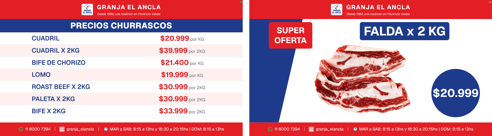

# Cartelería de precios

Cartelería digital para comercios de barrio: una pantalla que rota entre la lista de precios y los carteles de ofertas, corriendo 24/7 en un Fire TV colgado en el local. Un solo deploy sirve a varios comercios, cada uno en su propia URL, con su paleta, sus textos y su planilla.

**[Ver la pantalla en vivo →](https://precios-el-ancla.vercel.app/)** (Granja El Ancla, el primer cliente)



<sub>Los dos modos entre los que rota la pantalla: tabla de precios (izquierda) y cartel de superoferta (derecha). Datos reales de la planilla del cliente.</sub>

---

## El problema

Granja El Ancla (Florencio Varela, desde 1984) mostraba sus precios en carteles impresos. Cada cambio de precio implicaba imprimir de nuevo, y en un rubro donde los valores se mueven seguido, los carteles quedaban desactualizados o directamente desaparecían.

El requisito real era más exigente que "hacer una landing":

- **Quien carga los precios no es técnico.** Tenía que poder actualizar desde algo que ya usa: una planilla de Google Sheets.
- **La pantalla no tiene teclado ni alguien que la atienda.** Corre en un Fire TV, sobre el navegador Silk, sin que nadie la mire durante horas. Si se cuelga, se queda colgada hasta que alguien lo note.
- **El costo tiene que ser cero.** Es un comercio de barrio: la solución no puede generar una factura mensual.

Todo lo que sigue son decisiones tomadas contra esas tres restricciones. Después del primer cliente apareció la cuarta: **el mismo deploy tiene que servir al siguiente comercio sin volver a armar nada.**

---

## Cómo funciona

```
Google Sheets del comercio (publicado como CSV)        Cloudinary (catálogo de imágenes)
        │                                                        │
        │  3 fetch en paralelo (productos · ofertas · config)     │  URL por slug, transformada al vuelo
        ▼                                                        ▼
Server Component  app/[tenant]/page.tsx  →  getPantallaData(tenant)
        │
        │  props del primer render (SSR)
        ▼
Client Component  PantallaRotativa.tsx
        │
        ├── templates/tabla/Clasica.tsx      (lista de precios)
        └── templates/cartel/<plantilla>.tsx (cartel de oferta, elegible por oferta desde la planilla)

Service Worker  ──  watchdog anti-freeze + cache network-first (incluye Cloudinary)
```

El dueño del negocio agrega una fila en la planilla y la oferta aparece en pantalla en la próxima recarga. No toca código, no entra a un panel, no hay deploy.

La planilla no trae solo datos: una pestaña `configuracion` controla el comportamiento de la pantalla — segundos de cartel, segundos de tabla, horarios de atenuado, horarios de atención, WhatsApp e Instagram del local. Cambiar el ritmo de la rotación es editar una celda.

Cada comercio vive en `/<slug>` (`/granja-elancla`). Su configuración —nombre, paleta, textos, GIDs de la planilla— está en `tenants/<slug>.ts`. La URL de su CSV, que da acceso a toda la planilla, está en una variable de entorno y no en el repo.

---

## Decisiones técnicas

Las que más definieron el proyecto. Cada una está documentada con su alternativa descartada en [`docs/decisiones.md`](docs/decisiones.md) y el [`CHANGELOG.md`](CHANGELOG.md).

### 1. Watchdog en el Service Worker, no en el main thread

Un kiosko que corre días enteros en hardware limitado termina congelándose: el main thread se muere y la pantalla queda con datos viejos, sin que nadie se entere.

La primera versión detectaba el freeze desde el propio main thread. No servía: **cualquier mecanismo en el main thread es inútil si el thread está muerto.**

La solución fue mover el watchdog al Service Worker, que corre en otro thread. Si deja de recibir señales de vida de la página, fuerza la recarga desde afuera. A eso se suma un reload preventivo cada 30 minutos que limpia memoria y listeners acumulados.

### 2. Polling eliminado: −99,4% de requests

La versión original consultaba Sheets periódicamente: **~4.320 requests por día**. Reemplazar el polling por recargas programadas lo bajó a **~25 requests diarios**, sin perder frescura de datos para el caso de uso real (los precios cambian algunas veces por día, no cada 20 segundos).

### 3. Imágenes en Cloudinary, con un catálogo universal

Las fotos de producto vivieron primero en el repo, con un pipeline propio de compresión (`sharp` en `prebuild`, un hook `pre-commit` y un workflow de GitHub Actions). Funcionaba, pero eran cuatro mecanismos para cuidar archivos de un solo cliente, y no escalaba a varios comercios subiendo imágenes.

Hoy todas las imágenes están en Cloudinary, en un **catálogo con nomenclatura universal** (`asado-de-tira`, `pollo-entero`) compartido por todos los clientes. La app arma la URL con `f_auto,q_auto,w_1200` y Cloudinary entrega WebP/AVIF al ancho justo — mejor que lo que hacía el pipeline, sin código propio. El repo no tiene PNGs salvo el favicon. `next/image` sigue descartado: consume cuota en la capa gratuita de Vercel.

### 4. Sin cache: el precio que ves es el precio de ahora

La pantalla usaba ISR (`revalidate = 60`) hasta que apareció la pregunta que importaba: *"si corrijo un precio y aprieto actualizar, ¿lo toma?"*. Con stale-while-revalidate, no.

Hoy corre con `export const dynamic = 'force-dynamic'` y los fetch en `cache: 'no-store'` con parámetro anti-cache. Cada recarga trae precios frescos.

**Trade-off aceptado y documentado:** sin ISR no hay última-versión-buena. Si Google Sheets falla, los lectores devuelven `[]` y la pantalla muestra el empty state hasta la próxima recarga (hasta 30 minutos). Se evaluó un fallback en `localStorage` y el cliente lo descartó: para este caso de uso, mostrar un precio viejo es peor que no mostrar nada.

### 5. Multitenant por path, sin SaaS

Para el segundo cliente había tres caminos: un deploy por comercio, un SaaS con registro y panel, o un solo deploy con N comercios por path. Se eligió el tercero: `carteleria.vercel.app/<slug>`, un archivo tipado por comercio en `tenants/`, y las URLs de las planillas en variables de entorno. Sin auth, sin base de datos, sin panel. El alta de un cliente es un archivo, una variable y un logo.

Los diseños son un **catálogo de plantillas**: hoy una tabla y un cartel, sin colores fijos (todo entra por CSS variables desde la paleta del comercio). Cada oferta puede elegir su plantilla de cartel desde un desplegable en la planilla; si no elige, usa la default del comercio.

---

## Stack

| | |
|---|---|
| Framework | Next.js 16 (App Router, Server Components) |
| UI | React 19, Tailwind CSS 4 |
| Lenguaje | TypeScript |
| Datos | Google Sheets publicado como CSV, una planilla por comercio |
| Imágenes | Cloudinary (catálogo universal, transformaciones por URL) |
| Offline / resiliencia | Service Worker (network-first + watchdog), PWA por comercio |
| Tests | `node --test` (sin dependencias) |
| CI | GitHub Actions: tipos + lint + tests + build en cada push |
| Deploy | Vercel |

---

## Estructura

```
app/
  page.tsx           "/" renderiza el comercio DEFAULT_TENANT
  [tenant]/          pantalla, rutas de dev, manifest PWA y error/loading por comercio
  api/[tenant]/      /api/<slug>/productos | ofertas | config
tenants/             un archivo por comercio + registro
templates/           catálogo de diseños: tabla/ y cartel/
components/          PantallaRotativa (rotación, reload, watchdog), Header, Footer, overlays
lib/                 lectura y parseo de los CSV, URLs de Cloudinary, helpers del alta; todo testeado
scripts/             `npm run alta`: alta de cliente desde la terminal
types/               tipos compartidos (Oferta, Tenant, …)
docs/                bitácora de implementación, decisiones técnicas, specs y planes
.github/workflows/   CI
```

---

## Desarrollo local

```bash
npm install
cp .env.local.example .env.local   # completar cloud name y la URL del CSV
npm run dev
```

Variables de entorno (ver [`.env.local.example`](.env.local.example)):

| Variable | Para qué |
|---|---|
| `DEFAULT_TENANT` | Slug del comercio que se sirve en `/` |
| `NEXT_PUBLIC_DEFAULT_TENANT` | Mismo valor, para el error boundary de `/` |
| `NEXT_PUBLIC_CLOUDINARY_CLOUD_NAME` | Cloud name de Cloudinary |
| `NEXT_PUBLIC_CLOUDINARY_CATALOGO` | Carpeta base del catálogo (`catalogo-comun`, plana; el rubro va como tag) |
| `TENANT_<SLUG>_CSV_URL` | Una por comercio: URL del CSV publicado de su planilla |

Scripts:

```bash
npm run dev     # desarrollo
npm run build   # build de producción
npm test        # node --test sobre lib/ y tenants/
npm run lint
npm run alta    # alta de un cliente (ver abajo)
```

Rutas de desarrollo: `/<slug>/vistaLista?index=N` y `/<slug>/vistaCartel?index=N` fijan la pantalla en un modo sin rotación.

---

## Alta de un cliente

Tres pasos, un solo lugar para los datos:

1. **Planilla.** Abrí el link "hacer una copia" de la planilla modelo, cargá
   productos/ofertas/config, y Archivo → Compartir → Publicar en la web → CSV.
   Copiá esa URL (la de `…/pub?output=csv`, sin gid).
2. **`npm run alta`** y contestá: nombre, slug (sugerido), eslogan, dos
   colores, badge, contactos, la URL de la planilla y la ruta del logo. El
   script:
   - lee `/pubhtml` de la planilla y **resuelve los gids solo** (busca las
     pestañas "ofertas" y "config" por nombre);
   - sube el logo a Cloudinary como `logos/<slug>`;
   - escribe `tenants/<slug>.ts` y lo registra en `tenants/index.ts`;
   - crea `TENANT_<SLUG>_CSV_URL` en Vercel (y en tu `.env.local`);
   - corre `npm test`.
3. **Commit + push.** Si otro comercio ya está en producción, fuera de su
   horario de atención: cada push deploya para todos.

URL para la TV: `<dominio>/<slug>`.

Requiere, solo en tu `.env.local`: `CLOUDINARY_API_KEY`, `CLOUDINARY_API_SECRET`,
`VERCEL_TOKEN`, `VERCEL_PROJECT_ID` (ver `.env.local.example`). Flags:
`--force` (sobreescribir un tenant), `--sin-logo`, `--sin-vercel`. También
acepta las respuestas por pipe, una por línea: `npm run alta < cliente.txt`.

La paleta completa se deriva de los dos colores; `tenants/<slug>.ts` queda
editable a mano para afinar cualquier cosa.

## Estado

En producción desde mayo de 2026 con Granja El Ancla, corriendo todos los días en el local.

Pendientes conocidos:

- Validar el watchdog en el navegador Silk real del Fire TV (hoy probado en Chrome de escritorio).
- Medir la latencia de publicación del CSV de Google (`/pub`) si el cliente nota demora al actualizar precios.

---

Desarrollado por [Jonathan Castro](https://www.linkedin.com/in/johnydeev/) · [Portfolio](https://castro-jonathan-portfolio.vercel.app)
